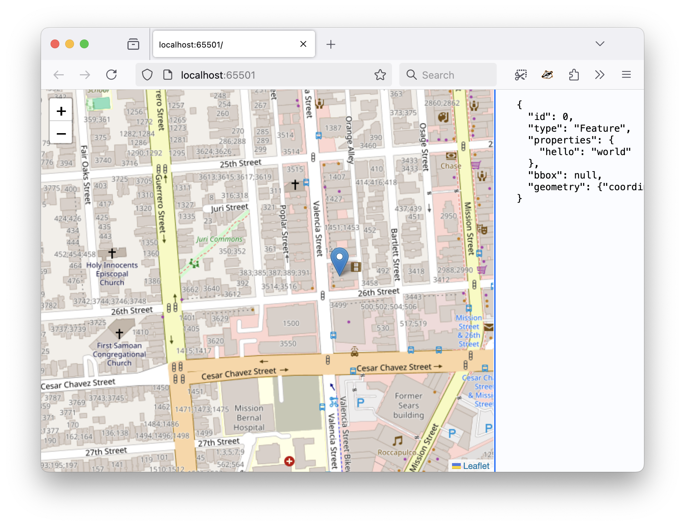

# whosonfirst-external-foursquare-venue-us

Who's On First ancestry data (parent ID and hierarchy) for Foursquare venues in United States.

## Description

This repository contains CSV files mapping individual records in the [Foursquare Open Places](https://opensource.foursquare.com/os-places/) dataset, located in the United States, to their Who's On First "parent" and "ancestor" (hierarchy) records.

This data was compiled using the [whosonfirst/go-whosonfirst-external](https://github.com/whosonfirst/go-whosonfirst-external?tab=readme-ov-file#assign-ancestors) package to "reverse geocode" each record using the [whosonfirst/go-whosonfirst-spatial-pmtiles](https://github.com/whosonfirst/go-whosonfirst-spatial-pmtiles) package.

Data is encoded as CSV rows with the following headers:

| Header | Notes |
| --- | --- |
| external:geometry | The WKT-encoded geometry for the record. |
| external:id | The unique ID assigned to the record (by Foursqure) |
| external:namespace | "fsq" |
| geohash | The geohash of the centroid associated with the external geometry |
| wof:country | The Who's On First country that the external record belongs to |
| wof:hierarchies | The Who's On First hierarchies associated with the external record, derived by doing a point-in-polygon lookup against the external geometry. |
| wof:parent_id | The Who's On First parent ID associated with the external record, derived by doing a point-in-polygon lookup against the external geometry. |

For example:

```
external:geometry,external:id,external:namespace,geohash,wof:country,wof:hierarchies,wof:parent_id
POINT(-64.7151968000689 18.348638265458188),50c383c3e4b009e3bc124040,4sq,hkmpcdcn,US,"[{""continent_id"":102191575,""country_id"":-1,""dependency_id"":85632169,""empire_id"":136253057,""locality_id"":101734681,""region_id"":85680575}]",101734681
POINT(-64.712322 18.348274),5154a227e4b00667a1c2d8be,4sq,hkmpce2z,US,"[{""continent_id"":102191575,""country_id"":-1,""dependency_id"":85632169,""empire_id"":136253057,""locality_id"":101734681,""region_id"":85680575}]",101734681
... and so on
```

Do these records really need to store the geometry associated with the Foursquare ID since they are already included in the Foursquare exports? Maybe not. Do these records really need to each store their complete Who's On First hierachies rather than referencing a separate file mapping parent IDs to hierarchies? Maybe. Do these files really need to store a geohash? Maybe not. Should there be a "belongs to" column which is the union of all the possible values to make it easier to determine if a venue is contained by a Who's On First ID (easier than querying multiple hierarchy dictionaries)? Maybe.

All of these are valid questions since their inclusion has a meaningful impact on the size of the CSV files and this repository. These details have not been finalized.

## File structure

All data are stored as bzip2-compressed CSV files in the `data` directory using the following conventions:

```
+ data
  + {WHOSONFIRST_REGION_ID}
    - us-{WHOSONFIRST_REGION_ID}-{WHOSONFIRST_LOCALITY_ID}.csv.bz2
    - us-{WHOSONFIRST_REGION_ID}-{WHOSONFIRST_LOCALITY_ID}.csv.bz2
```

In the event that either `{WHOSONFIRST_REGION_ID}` or `{WHOSONFIRST_LOCALITY_ID}` are unknown they will be replaced by "xx". For example:

```
+ data
  + {WHOSONFIRST_REGION_ID}
    - us-{WHOSONFIRST_REGION_ID}-xx.csv.bz2
  + xx
    - us-xx-xx.csv.bz2
    - us-xx-{WHOSONFIRST_LOCALITY_ID}.csv.bz2
```

### Notes

* While it may seem counter-intuitive to be able to know a locality ID but not its region ID this happens and reflects data that needs to be corrected in the Who's On First administrative dataset. Life is complicated that way.

* The bzip2-compressed CSV files in the `data` directory are tracked and stored using [git lfs](https://git-lfs.com/).

## DuckDB

These CSV files are meant to be "useable" from [DuckDB](https://duckdb.org/docs/data/csv/overview.html) or other similar database systems.

```
$> duckdb
v1.1.3 19864453f7
Enter ".help" for usage hints.
Connected to a transient in-memory database.
Use ".open FILENAME" to reopen on a persistent database.

D DESCRIBE(SELECT * FROM read_csv('us-85680575-101734683.csv'));
┌────────────────────┬─────────────┬─────────┬─────────┬─────────┬─────────┐
│    column_name     │ column_type │  null   │   key   │ default │  extra  │
│      varchar       │   varchar   │ varchar │ varchar │ varchar │ varchar │
├────────────────────┼─────────────┼─────────┼─────────┼─────────┼─────────┤
│ external:geometry  │ VARCHAR     │ YES     │         │         │         │
│ external:id        │ VARCHAR     │ YES     │         │         │         │
│ external:namespace │ VARCHAR     │ YES     │         │         │         │
│ geohash            │ VARCHAR     │ YES     │         │         │         │
│ wof:country        │ VARCHAR     │ YES     │         │         │         │
│ wof:hierarchies    │ VARCHAR     │ YES     │         │         │         │
│ wof:parent_id      │ BIGINT      │ YES     │         │         │         │
└────────────────────┴─────────────┴─────────┴─────────┴─────────┴─────────┘
```

_Note: Unfortunately, DuckDB [does not support reading bz2-compressed CSV files yet](https://github.com/duckdb/duckdb/discussions/12232) which means you will need to decompress the files in this repository before using them. This is not ideal but because the uncompressed CSV data is so big it is a recognized "trade-off"._

### Example (basic)

Query for Foursquare venues parented by the localit of [Cruz Bay](https://spelunker.whosonfirst.org/id/101734683) in the Virgin Islands:

```
$> duckdb
v1.1.3 19864453f7
Enter ".help" for usage hints.
Connected to a transient in-memory database.
Use ".open FILENAME" to reopen on a persistent database.

D SELECT "external:id"  FROM read_csv(['us-85680575-101734683.csv', 'us-85681227-101734613.csv']) WHERE JSON("wof:hierarchies")[0]."locality_id" = 101734683 LIMIT 10;
┌──────────────────────────┐
│       external:id        │
│         varchar          │
├──────────────────────────┤
│ 56d89ea2cd107fd76b7835d4 │
│ 4bc71cd78b7c9c7464c935cf │
│ 4b8f012bf964a520e44333e3 │
│ 554918fa498ebde87bb273d4 │
│ 4cc18d5622ce46883a223e47 │
│ 4c49de921b430f47b42821c4 │
│ 4bdef0a3fe0e62b57c110606 │
│ 4dd3c5557d8b6704c7ac9c11 │
│ 4be61bb9cf200f471d3f143c │
│ 4b4f5927f964a5207a0227e3 │
├──────────────────────────┤
│         10 rows          │
└──────────────────────────┘
```

### Example (crosswalk)

And to be something which can be used in conjunction with the source Foursquare data. For example here are 10 Foursquare places that are in the locality of [Cruz Bay](https://spelunker.whosonfirst.org/id/101734683) in the Virgin Islands:

```
$> duckdb
v1.1.3 19864453f7
Enter ".help" for usage hints.
Connected to a transient in-memory database.
Use ".open FILENAME" to reopen on a persistent database.

D SELECT w."external:id", f.name  FROM read_csv(['us-85680575-101734683.csv', 'us-85681227-101734613.csv']) w, read_parquet('/usr/local/data/foursquare/parquet/*.parquet') f  WHERE f.fsq_place_id = w."external:id" AND JSON("wof:hierarchies")[0]."locality_id" = 101734683 LIMIT 10;
┌──────────────────────────┬─────────────────────────┐
│       external:id        │          name           │
│         varchar          │         varchar         │
├──────────────────────────┼─────────────────────────┤
│ 53f4d120498e975d53c8c0df │ Yogurt in love          │
│ 5689a639498e55b3af28e427 │ The Bowery              │
│ 4ed0f08ef790d0703911f770 │ Lone Star Taquería      │
│ 5af1ffde364d97002cfa1eeb │ On the Sea Charters     │
│ 4c311d323896e21eda94e690 │ Margarita Phil's        │
│ 4c47242419fde21ef25f0776 │ Kaleidoscope Video      │
│ 512f973345b0fa9f2372a111 │ ilanality Boat Charters │
│ 55156c2b498efa5147e50cf0 │ Jack's                  │
│ 4dda98ad7d8b3226643a167b │ Villa Hibiscus          │
│ 5512dc52498ef72936416f89 │ Sip & Chill             │
├──────────────────────────┴─────────────────────────┤
│ 10 rows                                  2 columns │
└────────────────────────────────────────────────────┘
```

### Example (merge)

Merge a slice of the Foursquare venues dataset with the parent and hierarchy information for the city of [San Francisco](https://spelunker.whosonfirst.org/id/85922583):

```
$> duckdb
v1.1.3 19864453f7
Enter ".help" for usage hints.
Connected to a transient in-memory database.
Use ".open FILENAME" to reopen on a persistent database.

D COPY (SELECT f.*, w.geohash, w."wof:country", w."wof:parent_id", w."wof:hierarchies" FROM read_parquet('/usr/local/data/foursquare/parquet/*.parquet') f, read_csv('/usr/local/data/fsq-us-85688637-85922583.csv') w WHERE f.fsq_place_id = w."external:id") TO 'foursquare-us-85688637-85922583.parquet' (COMPRESSION ZSTD);

D DESCRIBE (SELECT * FROM read_parquet('foursquare-us-85688637-85922583.parquet'));
┌─────────────────┬───────────────────────────────────────────────────────────────────────────────────────────────────────────────────────────────────┬─────────┬─────────┬─────────┬─────────┐
│   column_name   │                                                            column_type                                                            │  null   │   key   │ default │  extra  │
│     varchar     │                                                              varchar                                                              │ varchar │ varchar │ varchar │ varchar │
├─────────────────┼───────────────────────────────────────────────────────────────────────────────────────────────────────────────────────────────────┼─────────┼─────────┼─────────┼─────────┤
│ id              │ VARCHAR                                                                                                                           │ YES     │         │         │         │
│ geometry        │ BLOB                                                                                                                              │ YES     │         │         │         │
│ bbox            │ STRUCT(xmin FLOAT, xmax FLOAT, ymin FLOAT, ymax FLOAT)                                                                            │ YES     │         │         │         │
│ version         │ INTEGER                                                                                                                           │ YES     │         │         │         │
│ sources         │ STRUCT(property VARCHAR, dataset VARCHAR, record_id VARCHAR, update_time VARCHAR, confidence DOUBLE)[]                            │ YES     │         │         │         │
│ names           │ STRUCT("primary" VARCHAR, common MAP(VARCHAR, VARCHAR), rules STRUCT(variant VARCHAR, "language" VARCHAR, "value" VARCHAR, "bet…  │ YES     │         │         │         │
│ categories      │ STRUCT("primary" VARCHAR, alternate VARCHAR[])                                                                                    │ YES     │         │         │         │
│ confidence      │ DOUBLE                                                                                                                            │ YES     │         │         │         │
│ websites        │ VARCHAR[]                                                                                                                         │ YES     │         │         │         │
│ socials         │ VARCHAR[]                                                                                                                         │ YES     │         │         │         │
│ emails          │ VARCHAR[]                                                                                                                         │ YES     │         │         │         │
│ phones          │ VARCHAR[]                                                                                                                         │ YES     │         │         │         │
│ brand           │ STRUCT(wikidata VARCHAR, "names" STRUCT("primary" VARCHAR, common MAP(VARCHAR, VARCHAR), rules STRUCT(variant VARCHAR, "languag…  │ YES     │         │         │         │
│ addresses       │ STRUCT(freeform VARCHAR, locality VARCHAR, postcode VARCHAR, region VARCHAR, country VARCHAR)[]                                   │ YES     │         │         │         │
│ geohash         │ VARCHAR                                                                                                                           │ YES     │         │         │         │
│ wof:country     │ VARCHAR                                                                                                                           │ YES     │         │         │         │
│ wof:parent_id   │ VARCHAR                                                                                                                           │ YES     │         │         │         │
│ wof:hierarchies │ VARCHAR                                                                                                                           │ YES     │         │         │         │
├─────────────────┴───────────────────────────────────────────────────────────────────────────────────────────────────────────────────────────────────┴─────────┴─────────┴─────────┴─────────┤
│ 18 rows                                                                                                                                                                           6 columns │
└─────────────────────────────────────────────────────────────────────────────────────────────────────────────────────────────────────────────────────────────────────────────────────────────┘
```

And then using the new `foursquare-us-85688637-85922583.parquet` to search for restaurants in the neighbourhood of [La Lengua](https://spelunker.whosonfirst.org/id/102112179):

```
D SELECT fsq_place_id, name, address, JSON("wof:hierarchies")[0].neighbourhood_id AS neighbourhood, latitude, longitude, date_closed FROM read_parquet('foursquare-us-85688637-85922583.parquet') WHERE neighbourhood=102112179 AND JSON(fsq_category_labels)[0]  LIKE '%Dining and Drinking > Restaurant%';
┌──────────────────────────┬───────────────────────────────────────────────────────────┬─────────────────────────┬───────────────┬────────────────────┬─────────────────────┬─────────────┐
│       fsq_place_id       │                           name                            │         address         │ neighbourhood │      latitude      │      longitude      │ date_closed │
│         varchar          │                          varchar                          │         varchar         │     json      │       double       │       double        │   varchar   │
├──────────────────────────┼───────────────────────────────────────────────────────────┼─────────────────────────┼───────────────┼────────────────────┼─────────────────────┼─────────────┤
│ 49e82080f964a52043651fe3 │ Shiso                                                     │ 3452 Mission St         │ 102112179     │  37.74151107474106 │ -122.42275836428959 │             │
│ 621addc87ef4586cf136210f │ Handroll Project                                          │ 598 Guerrero St         │ 102112179     │ 37.749129750195024 │ -122.42012729046951 │             │
│ 538e9099498e6cb5c9c8c44c │ Chans Cuisine                                             │ 3486 Mission St         │ 102112179     │  37.74098496591807 │ -122.42322883483135 │             │
│ 4f43690119834bc91f56a0e0 │ Intimate Catering                                         │ 709 San Jose Ave        │ 102112179     │ 37.743690807207656 │ -122.42245723445374 │             │
│ 6488c42f32a4651d3b5f0043 │ Dosa Corner Indian Cuisine                                │ 1499 Valencia St        │ 102112179     │ 37.749129750195024 │ -122.42012729046951 │             │
│ 4e4d0707bd413c4cc66e17f9 │ Cafe Arguello                                             │ 2832 Mission St         │ 102112179     │ 37.751526662778815 │ -122.41869236022052 │             │
│ 4a2b6e95f964a520cf961fe3 │ Red Cafe                                                  │ 2894 Mission St         │ 102112179     │  37.75072935187312 │ -122.41836375085727 │             │
│ 5d1014a744627d0023b0c98c │ Bac Lieu Restaurant                                       │ 3216 Mission St         │ 102112179     │  37.74528560251274 │ -122.42040183307378 │             │
│ 57abdbbf498e050aca7c3f8b │ Firepie                                                   │ 3498 Cesar Chavez       │ 102112179     │ 37.748332854085916 │ -122.41986525188636 │             │
...
│ 49e0c8c0f964a5206f611fe3 │ La Traviata                                               │ 2854 Mission St         │ 102112179     │   37.7512874341159 │ -122.41841286461101 │             │
│ 52fc58f2498e69bb0c138b25 │ ICHI Sushi + NI Bar                                       │ 3282 Mission St         │ 102112179     │  37.74432783375875 │ -122.42086357150288 │ 2017-01-10  │
│ 4f32798a19836c91c7db6197 │ Rosies Restaurant                                         │ 2976 Mission St         │ 102112179     │  37.74941770225027 │ -122.41849616424369 │             │
│ 42accc80f964a52039251fe3 │ Emmy's Spaghetti Shack                                    │ 3230 Mission St         │ 102112179     │  37.74502182026873 │  -122.4203463391657 │             │
│ 4a94231ef964a5207f2020e3 │ Pi Bar                                                    │ 1432 Valencia St        │ 102112179     │  37.74997691324565 │ -122.42059223044018 │ 2023-04-07  │
├──────────────────────────┴───────────────────────────────────────────────────────────┴─────────────────────────┴───────────────┴────────────────────┴─────────────────────┴─────────────┤
│ 68 rows (40 shown)                                                                                                                                                            7 columns │
└─────────────────────────────────────────────────────────────────────────────────────────────────────────────────────────────────────────────────────────────────────────────────────────┘
```

Spot-checking the record for "Handroll Project" which, you might know if you live in San Francisco, should not parented by La Lengua:

```
$> pt2f -latitude 37.749129750195024 -longitude -122.42012729046951 | show -
```

Shows us the the Foursquare coordinate data for that venue is incorrect and off by nine blocks from the address they've recorded (which is correct):



_Where `pt2f` and `show` are part of the [aaronland/go-tools](https://spelunker.whosonfirst.org/id/102112179) and [sfomuseum/go-geojson-show](https://github.com/sfomuseum/go-geojson-show?tab=readme-ov-file#show) packages, respectively._

### Example (search)

This example demonstrates how to create and persist a searchable ([FTS](https://duckdb.org/docs/extensions/full_text_search.html)) DuckDB database for all the Foursquare venues in [San Francisco](https://spelunker.whosonfirst.org/id/85922583) (California):

First copy the Foursquare - Who's On First mapping file to the current working directory and uncompress it:

```
$> cd /usr/local/data/whosonfirst-external-foursquare-venue-us/data/85688637/us-85688637-85922583.csv.bz2 .
$> bunzip us-85688637-85922583.csv.bz2
```

Second, start DuckDB and create a new search table joining the data in the mapping file with the Foursquare places parquet files. Create a full-text search (FTS) index on the table, query it to prove it works and then export the entire database to a directory called `/usr/local/data/sf-search`.

```
$> duckdb
v1.1.3 19864453f7
Enter ".help" for usage hints.
Connected to a transient in-memory database.
Use ".open FILENAME" to reopen on a persistent database.

D CREATE TABLE search AS SELECT f.fsq_place_id AS id, f.name AS name, f.address AS address FROM read_parquet('/usr/local/data/foursquare/parquet/*.parquet') f, read_csv('us-85688637-85922583.csv') w WHERE f.fsq_place_id = w."external:id";

D PRAGMA create_fts_index('search', 'id', 'name', 'address');

D SELECT fts_main_search.match_bm25(id, 'volcano') AS score, id, name, address FROM search WHERE score IS NOT NULL ORDER BY score DESC;
┌────────────────────┬──────────────────────────┬────────────────────────┬──────────────────┐
│       score        │            id            │          name          │     address      │
│       double       │         varchar          │        varchar         │     varchar      │
├────────────────────┼──────────────────────────┼────────────────────────┼──────────────────┤
│  5.660612435591871 │ 6355aa5ec60fa245371ed2da │ Volcano Kimchi         │                  │
│  5.660612435591871 │ 604d00622944e85926467694 │ Volcano Kimchi         │                  │
│ 4.5301393234755425 │ 66f87e8a4ccc8b122de9ecd5 │ Volcano Kimchi         │ 1074 Illinois St │
│   4.11885399466349 │ 49f2b815f964a520626a1fe3 │ Volcano Curry of Japan │ 5454 Geary Blvd  │
└────────────────────┴──────────────────────────┴────────────────────────┴──────────────────┘

D EXPORT DATABASE '/usr/local/data/sf-search' (FORMAT PARQUET);
```

Exit DuckDb and examine the newly created database folder:

```
$> du -h /usr/local/data/sf-search/
 13M	/usr/local/data/sf-search/
```

Start DuckDB again, import the database and perform another query:

```
$> duckdb
v1.1.3 19864453f7
Enter ".help" for usage hints.
Connected to a transient in-memory database.
Use ".open FILENAME" to reopen on a persistent database.

D IMPORT DATABASE '/usr/local/data/sf-search';
D SELECT fts_main_search.match_bm25(id, 'volcano') AS score, id, name, address FROM search WHERE score IS NOT NULL ORDER BY score DESC;
┌────────────────────┬──────────────────────────┬────────────────────────┬──────────────────┐
│       score        │            id            │          name          │     address      │
│       double       │         varchar          │        varchar         │     varchar      │
├────────────────────┼──────────────────────────┼────────────────────────┼──────────────────┤
│  5.660612435591871 │ 6355aa5ec60fa245371ed2da │ Volcano Kimchi         │                  │
│  5.660612435591871 │ 604d00622944e85926467694 │ Volcano Kimchi         │                  │
│ 4.5301393234755425 │ 66f87e8a4ccc8b122de9ecd5 │ Volcano Kimchi         │ 1074 Illinois St │
│   4.11885399466349 │ 49f2b815f964a520626a1fe3 │ Volcano Curry of Japan │ 5454 Geary Blvd  │
└────────────────────┴──────────────────────────┴────────────────────────┴──────────────────┘
```

It does not appear to be possible to copy the `search` table AND the FTS index to a single standalone Parquet file to be queried using the `read_parquet(...)` syntax. Or if it is, I haven't figured out the syntax and I would welcome suggestions and pointers. It is possible to export just the (search) table and rebuild the index, in memory, at runtime.

## See also

* https://opensource.foursquare.com/os-places/
* https://github.com/whosonfirst/go-whosonfirst-external